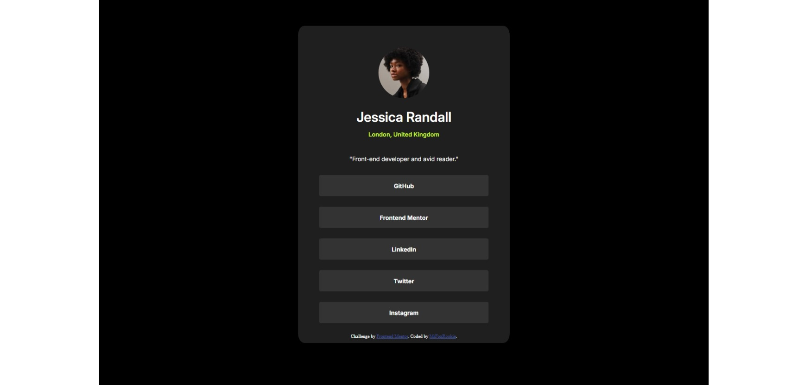

# Frontend Mentor - Social links profile solution

## Overview

### The challenge

Users should be able to:

- See hover and focus states for all interactive elements on the page

### Screenshot

### Links

- Solution URL: [Add solution URL here](https://your-solution-url.com)
- Live Site URL: [Add live site URL here](https://your-live-site-url.com)

## My process

It is difficult to describe my process, but I can only say that the easiest way to do this is to do it first, quietly, and second, in parts, so that the code does not get out of hand.
P.S. I sincerely recommend that all the findings and learnings that you have the notes in a note program like Notion, it helps you not to forget and also is very useful for later, especially with the different ways that exist to do something as basic as centering an element.

### Built with

- Semantic HTML5 markup
- CSS custom properties
- Flexbox

### What I learned

I learned mainly the positioning of elements, which although it seems simple, at least in my case it was a little difficult at the beginning. 

### Continued development

There are several areas that I would still like to improve, but if I had to say one in specific it would be without any doubt everything related to the positioning of elements. Especially with everything that derives from display: flex because, despite knowing these concepts, I still do not have enough knowledge to use it accurately and effectively, which I hope to improve in the near future.

### Useful resources

- [freeCodeCamp](https://www.freecodecamp.org/learn) - freeCodeCamp basically helped me get started in all this web development stuff, for which I am deeply grateful. 

- [Coding Fantasy](https://codingfantasy.com/games) - If you read this and have problems with flexbox and the grid, I definitely recommend you to go to this page. Basically it's a video game in which you learn these concepts in a very intuitive and cool way. It's hard to explain, but I really recommend you to take a look at this page, you won't regret it.

## Author

- GitHub - [MrFoxRookie](https://github.com/MrFoxRookie)
- Frontend Mentor - [@MrFoxRookie](https://www.frontendmentor.io/profile/MrFoxRookie)

## Acknowledgments

